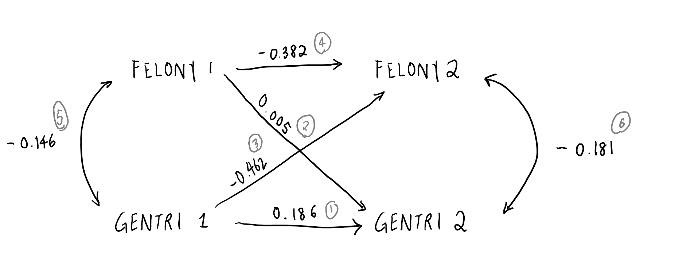

```{r cache = TRUE}
# needed for fread
library(data.table)

# temporary - so I don't have to use wait for it to load when I refresh source 
nypd  <- fread("data/NYPD/nypd_brooklyn.csv", header = TRUE)

# functions located in another R sheet
source("thesis_code_functions.R")


```
    
# Doing it Manually instead 
But separating it because I may use each one. 

```{r cache = TRUE, message = FALSE, warning = FALSE}

# STEP 1: getting data for each year per tract - crime (nypd) and gentrification variables (census)

# 1.1 - different types of felonies
bk_count_2010 <- crimeCount(2010) # crime 
bk_count_2011 <- crimeCount(2011) # crime 
bk_count_2012 <- crimeCount(2012) # crime 
bk_count_2013 <- crimeCount(2013) # crime 
bk_count_2014 <- crimeCount(2014) # crime 
bk_count_2015 <- crimeCount(2015) # crime 
bk_count_2016 <- crimeCount(2016) # crime 
bk_count_2017 <- crimeCount(2017) # crime 
bk_count_2018 <- crimeCount(2018) # crime 

# 1.2 - getting census variables for calculating gentrification score
bk_gentri_2010 <- bkGentri(2010) # gentrification 
bk_gentri_2011 <- bkGentri(2011) # gentrification
bk_gentri_2012 <- bkGentri(2012) # gentrification
bk_gentri_2013 <- bkGentri(2013) # gentrification
bk_gentri_2014 <- bkGentri(2014) # gentrification
bk_gentri_2015 <- bkGentri(2015) # gentrification
bk_gentri_2016 <- bkGentri(2016) # gentrification
bk_gentri_2017 <- bkGentri(2017) # gentrification
bk_gentri_2018 <- bkGentri(2018) # gentrification

# STEP 2: Calculate the gentrification score 

# changes between variables between two years by the 750 tracts
# gentrification change rates for each year 2010-2018
bk_gen_2010_2011 <- calcChange(bk_gentri_2010, bk_gentri_2011)
bk_gen_2011_2012 <- calcChange(bk_gentri_2011, bk_gentri_2012)
bk_gen_2012_2013 <- calcChange(bk_gentri_2012, bk_gentri_2013)
bk_gen_2013_2014 <- calcChange(bk_gentri_2013, bk_gentri_2014)
bk_gen_2014_2015 <- calcChange(bk_gentri_2014, bk_gentri_2015)
bk_gen_2015_2016 <- calcChange(bk_gentri_2015, bk_gentri_2016)
bk_gen_2016_2017 <- calcChange(bk_gentri_2016, bk_gentri_2017)
bk_gen_2017_2018 <- calcChange(bk_gentri_2017, bk_gentri_2018)
bk_gen_all <- calcChange(bk_gentri_2010, bk_gentri_2018)


# STEP 3: Combine gentrification and crime 

# merging tracts 
# variables by the 750 tracts AND neighborhoods between two years
bk_gen_crime_2010 <- mergeTracts(bk_gen_2010_2011, bk_count_2010, bk_count_2011)
bk_gen_crime_2011 <- mergeTracts(bk_gen_2011_2012, bk_count_2011, bk_count_2012)
bk_gen_crime_2012 <- mergeTracts(bk_gen_2012_2013, bk_count_2012, bk_count_2013)
bk_gen_crime_2013 <- mergeTracts(bk_gen_2013_2014, bk_count_2013, bk_count_2014)
bk_gen_crime_2014 <- mergeTracts(bk_gen_2014_2015, bk_count_2014, bk_count_2015)
bk_gen_crime_2015 <- mergeTracts(bk_gen_2015_2016, bk_count_2015, bk_count_2016)
bk_gen_crime_2016 <- mergeTracts(bk_gen_2016_2017, bk_count_2016, bk_count_2017)
bk_gen_crime_2017 <- mergeTracts(bk_gen_2017_2018, bk_count_2017, bk_count_2018)
bk_gen_crime_all <- mergeTracts(bk_gen_all, bk_count_2010, bk_count_2018)


# STEP 4: Keep Neighborhood tracts as granularity

# Calculate crime count and gentrification scores for neighborhood level 
# 50 Neighborhoods, Gentrification Score, Each year (2010 is the earliest) for 2010-2018
bkg_2010 <- calcScore(bk_gen_crime_2010)
bkg_2011 <- calcScore(bk_gen_crime_2011)
bkg_2012 <- calcScore(bk_gen_crime_2012)
bkg_2013 <- calcScore(bk_gen_crime_2013)
bkg_2014 <- calcScore(bk_gen_crime_2014)
bkg_2015 <- calcScore(bk_gen_crime_2015)
bkg_2016 <- calcScore(bk_gen_crime_2016)
bkg_2017 <- calcScore(bk_gen_crime_2017)

bkg_all <- calcScore(bk_gen_crime_all)
bkg_ct_all <- calcScore_CT(bk_gen_crime_all)


beep()

```

# Keeping Non-Gentrified Areas  
  
```{r}

bkg_no_gentri <- bkg_all %>% 
  filter(NTA_GENTRI_SCORE < 0)


```


# Plot: Scatterplot of Gentrification & Crime - Neighborhood in Text  
  
```{r}

# - - - - - - - - - - - - - - - - - - - - - - - - - - - - - - - - - # 
# ------------- PLOT: Text Scatter of Gentri & Crime -------------- # 
# - - - - - - - - - - - - - - - - - - - - - - - - - - - - - - - - - # 

# distinguishing gentrified and less gentrified neighborhoods (binary)

pts10 <- plotTextScatter(bkg_2010, "2010", "2011")
pts11 <- plotTextScatter(bkg_2011, "2011", "2012")
pts12 <- plotTextScatter(bkg_2012, "2012", "2013")
pts13 <- plotTextScatter(bkg_2013, "2013", "2014")
pts14 <- plotTextScatter(bkg_2014, "2014", "2015")
pts15 <- plotTextScatter(bkg_2015, "2015", "2016")
pts16 <- plotTextScatter(bkg_2016, "2016", "2017")
pts17 <- plotTextScatter(bkg_2017, "2017", "2018")
pts_all <- plotTextScatter(bkg_all, "2010", "2018")
pts_no <- plotTextScatter(bkg_no_gentri, "2010", "2018")

pts_grid <- plot_grid(pts10, pts11, pts12,
                      pts13, pts14, pts15,
                      pts16, pts17, pts_all,
                      ncol = 3)

pts_all + 
  labs(title = "\n \nText Scatterplot of All Neighborhoods", 
       subtitle = "Positioned by Gentrification Index Score and Change in Crime Rates (2010 - 2018)\n \n")  
  
pts_no + 
  xlim(min(-5), max(1)) + 
  geom_vline(xintercept = 0, color = "#333333") + 
  labs(title = "\nText Scatterplot of Non-Gentrified Neighborhoods", 
       subtitle = "Gentrification Index Score and Change in Crime Rates (2010 - 2018)\n")


# ggsave("visualizations/plot_text_scatter_grid.pdf", pts_grid, width = 12, height = 10)
beep()
ggsave("visualizations/Text Scatter/all-gentri-text-scatter.svg", width = 8, height = 5)

```


# Dataframe of Binary Values - Gentrified vs. Not Gentrified, for each year    
  
(For Time Series Lab I assignment)   
  
```{r warning = FALSE}

# Making it Binary 

# using ntaMean function
nta_mean <- ntaMean(bkg_2011, 2011) %>% 
  bind_rows(ntaMean(bkg_2012, 2012)) %>%
  bind_rows(ntaMean(bkg_2013, 2013)) %>%
  bind_rows(ntaMean(bkg_2014, 2014)) %>% 
  bind_rows(ntaMean(bkg_2015, 2015)) %>% 
  bind_rows(ntaMean(bkg_2014, 2016)) %>% 
  bind_rows(ntaMean(bkg_2015, 2017))


nta_mean_2 <- data.frame(gentrified = "FALSE", 
                         avg_gentri = 0, 
                         avg_crime_rate_1 = nta_mean$avg_crime_rate_2[[13]], 
                         avg_crime_rate_2 = 0,
                         crime_change = 0,
                         year = 2018) 

nta_mean_3 <- data.frame(gentrified = "TRUE", 
                         avg_gentri = 0, 
                         avg_crime_rate_1 = nta_mean$avg_crime_rate_2[[14]], 
                         avg_crime_rate_2 = 0, 
                         crime_change = 0,
                         year = 2018) 


nta_mean_final <- nta_mean %>% 
  rbind(nta_mean_2) %>% 
  rbind(nta_mean_3)

# write.csv(nta_mean_final, "nta-gentri-crime-2010-2018.csv")

beep()
```
# Time Series Visualization  
  
```{r message = FALSE, warning = FALSE}

g_trend <- ggplot() +
  # plot points
  geom_point(data = nta_mean, 
             x = nta_mean$year,
             y = nta_mean$avg_crime_rate_1*100,
             group = nta_mean$gentrified, 
             color = "grey60") +
  # plot trend line connecting points
  geom_line(aes(x = nta_mean$year,
                y = nta_mean$avg_crime_rate_1*100,
                group = nta_mean$gentrified,
                color = nta_mean$gentrified),
                size = 1.02) +
  # legend label 
  scale_color_discrete(name = "Gentrification", labels = c("Absent", "Present")) +
  # tbeme elemnts
  theme_minimal() +
  theme(text = element_text(family = "raleway"),
        plot.title = element_text(family = "montserrat"))


g_trend_curve <- g_trend + 
  stat_smooth(aes(x = nta_mean$year,
                  y = nta_mean$avg_crime_rate_1*100, 
                   group = nta_mean$gentrified), 
              method = "lm", 
              formula = y ~ x + I(x^2), 
              size = 1, 
              color = "white", 
              alpha = 0.3) + 
  scale_x_continuous(breaks = nta_mean$year) +
  labs(title = "\nCrime in Brooklyn between\nGentrified & Non-Gentrified Neighborhoods (2010 - 2018)\n", 
       x = "\nYear\n",
       y = "\nAverage Crime Rate (Felony)\n") 


# ggsave("visualizations/trend_analysis_curve.svg", g_trend_curve, width = 8, height = 5)
beep()
```


# Time Series all trend lines

```{r}

bkg_2010$YEAR <- "2010"
bkg_2011$YEAR <- "2011"
bkg_2012$YEAR <- "2012"
bkg_2013$YEAR <- "2013"
bkg_2014$YEAR <- "2014"
bkg_2015$YEAR <- "2015"
bkg_2016$YEAR <- "2016"
bkg_2017$YEAR <- "2017"

bkg_all_no_gentri <- bkg_all %>% 
  filter(NTA_GENTRI_SCORE < 0)
bkg_all_no_gentri$YEAR <- NA
bkg_all_no_gentri$GENTRI <- FALSE


bkg_all_gentri <- bkg_all %>% 
  filter(NTA_GENTRI_SCORE >= 0)
bkg_all_gentri$YEAR <- NA 
bkg_all_gentri$GENTRI <- TRUE


bkg_years <- bkg_2010 %>% 
  bind_rows(bkg_2011) %>%
  bind_rows(bkg_2012) %>%
  bind_rows(bkg_2013) %>%
  bind_rows(bkg_2014) %>%
  bind_rows(bkg_2015) %>%
  bind_rows(bkg_2016) %>%
  bind_rows(bkg_2017)

# write.csv(bkg_years, "data/bkg_years.csv")

bkg_years_no_gentri <- bkg_years %>% 
  semi_join(bkg_all_no_gentri, "NTA_CODE") %>% 
  drop_na("YEAR") # needs tidyverse

# bkg_years_gentri <- bkg_years %>% 
  # semi_join(bkg_all_gentri, "NTA_CODE")


  
top_10_gentri <- bkg_all_no_gentri %>% 
  as.data.frame() %>%
  filter(! NTA_NAME %in% c("Brooklyn Heights-Cobble Hill", "Greenpoint")) %>%
  arrange(desc(NTA_GENTRI_SCORE)) %>% 
  slice(1:10) 

top_10_crime <- bkg_all_no_gentri %>% 
  as.data.frame() %>%
  filter(! NTA_NAME %in% c("Brooklyn Heights-Cobble Hill", "Greenpoint")) %>%
  arrange(desc(FEL_NTA_CHANGE)) %>% 
  slice(1:10) 


low_5 <- bkg_all_no_gentri %>% 
  as.data.frame() %>%
  filter(! NTA_NAME %in% c("Brooklyn Heights-Cobble Hill", "Greenpoint")) %>%
  arrange(NTA_GENTRI_SCORE) %>% 
  slice(1:5) 


```

 
 
  
    
# Time Series Cross-Lagged Model  
  
This Time Series Cross-Lagged Model would analyze whether gentrification has led to an increase in crime rate in Brooklyn. 
  
### 1. Usual OLS Models   
  
```{r}

options(scipen = 999)
library(lavaan)

summary(lm(data = bkg_years, NTA_GENTRI_SCORE ~ FEL_NTA_CHANGE))
summary(lm(data = bkg_years, FEL_NTA_CHANGE ~ NTA_GENTRI_SCORE))


```

From the usual OLS model, for each increase in one point of change of felony crime rates per capita, there is likely to be a 11.27 decrease in gentrification score.   
In the other regression, for each increase in one point of gentrification score, there is likely to be a decrease in change of felony crime rates by -0.000108.  
  
    
### 2. SEM Two-way cross-lagged model  
Are either of the cross-lags significant?  
  
```{r}

bkg_years_split_1 <- bkg_years %>% 
  filter(YEAR %in% c(2010:2013)) %>% 
  group_by(NTA_CODE, NTA_NAME) %>%
  mutate(NTA_GENTRI_SCORE_1 = mean(NTA_GENTRI_SCORE)) %>% 
  mutate(FEL_NTA_CHANGE_1 = mean(FEL_NTA_CHANGE)) %>% 
  dplyr::select(NTA_NAME, NTA_CODE, NTA_GENTRI_SCORE_1, FEL_NTA_CHANGE_1) %>%
  distinct()

bkg_years_split_2 <- bkg_years %>% 
  filter(YEAR %in% c(2014:2017)) %>% 
  group_by(NTA_CODE, NTA_NAME) %>%
  mutate(NTA_GENTRI_SCORE_2 = mean(NTA_GENTRI_SCORE)) %>% 
  mutate(FEL_NTA_CHANGE_2 = mean(FEL_NTA_CHANGE)) %>%
  dplyr::select(NTA_NAME, NTA_CODE, NTA_GENTRI_SCORE_2, FEL_NTA_CHANGE_2) %>%
  distinct()

bkg_years_split <- bkg_years_split_1 %>% 
  left_join(bkg_years_split_2, by = c("NTA_NAME", "NTA_CODE"))

cl_model <- '
  NTA_GENTRI_SCORE_2 ~ NTA_GENTRI_SCORE_1 + FEL_NTA_CHANGE_1
  FEL_NTA_CHANGE_2 ~ NTA_GENTRI_SCORE_1 + FEL_NTA_CHANGE_1  
  NTA_GENTRI_SCORE_1 ~~ FEL_NTA_CHANGE_1
  FEL_NTA_CHANGE_2 ~~ FEL_NTA_CHANGE_2 '

cl_fit <- sem(cl_model, data = bkg_years_split)

summary(cl_fit, fit.measures = FALSE, standardized = TRUE, rsquare = TRUE)

```

```{r pressure, echo=FALSE, fig.cap="Cross-Laggged", out.width = '100%'}



```    

```{r}
beta_1 <- 0.462
beta_2 <- 0.005
stronger <- beta_1/beta_2

print(paste("There is evidence of mutual and reciprocal causation, though the effect of gentrification on felony crime rates (Beta = ", beta_1, ") is ", stronger, " times stronger than the opposite effect, (Beta = ", beta_2, ")", sep = ""))

```
  
## 3. Fit Measures  

```{r}
summary(cl_fit, fit.measures = TRUE, standardized = TRUE, rsquare = TRUE)
```

  
### Minimum Function Test Statistic  
    
   Number of observations                            50  
                                                      
Model Test User Model:  
                                                         
  Test statistic                                 0.000  
  Degrees of freedom                                 0  
  
Model Test Baseline Model:  
  
  Test statistic                                22.883  
  Degrees of freedom                                 6  
  P-value                                        0.001  
  
User Model versus Baseline Model:  
  
  Comparative Fit Index (CFI)                    1.000  
  Tucker-Lewis Index (TLI)                       1.000  
  
     
### Likelihood Ratio Tests to Compare Models  
    
User Model versus Baseline Model:  
  
  Comparative Fit Index (CFI)                    1.000  
  Tucker-Lewis Index (TLI)                       1.000  
    
Loglikelihood and Information Criteria:  
  
  Loglikelihood user model (H0)                 99.937  
  Loglikelihood unrestricted model (H1)         99.937  
                                                      
  Akaike (AIC)                                -179.874  
  Bayesian (BIC)                              -160.754  
  Sample-size adjusted Bayesian (BIC)         -192.142  
    
    
### Root Mean Square Error Measures  
  
Root Mean Square Error of Approximation:  
  
  RMSEA                                          0.000  
  90 Percent confidence interval - lower         0.000  
  90 Percent confidence interval - upper         0.000  
  P-value RMSEA <= 0.05                             NA  
  
Standardized Root Mean Square Residual:  
  
  SRMR                                           0.000  
  

 
# Spatial Mapping Visualizations 

```{r cache = TRUE}


nta_map_2010 <- toSpatial_NTA(bkg_2010)
nta_map_2011 <- toSpatial_NTA(bkg_2011)
nta_map_2012 <- toSpatial_NTA(bkg_2012)
nta_map_2013 <- toSpatial_NTA(bkg_2013)
nta_map_2014 <- toSpatial_NTA(bkg_2014)
nta_map_2015 <- toSpatial_NTA(bkg_2015)
nta_map_2016 <- toSpatial_NTA(bkg_2016)
nta_map_2017 <- toSpatial_NTA(bkg_2017) 

nta_map_all <- toSpatial_NTA(bkg_all)
nta_map_ct_all <- toSpatial_tracts(bkg_ct_all)


nta_map_no_gentri <- toSpatial_NTA(bkg_no_gentri)


# tract_map_2010 <- toSpatial_tracts(bk_test)

# Exporting file as Spatial Object .shp  
nta_map_no_gentri_spa <-  nta_map_no_gentri %>% 
  as_Spatial()
# writeOGR(obj = nta_map_no_gentri_spa, dsn = "nta_map_no_gentri", layer = "layers", driver = "ESRI Shapefile")

beep()
```


```{r message = FALSE, warning = FALSE} 

# plotMapGentri <- function(df, year_1, year_2) {
#   
#   ggplot(data = df) +
#     geom_sf(aes(fill = NTA_GENTRI_SCORE), color = NA) +
#     scale_fill_viridis_c(option = "magma", name = "Gentrification Score") + 
#     labs(title = paste("\n", year_1, "-", year_2, "\n")) + 
#     theme_map() + 
#     theme(text = element_text(family = "raleway", size = 12), 
#           plot.title = element_text(family = "jaapokki", size = 18))
#   
# }
  

# for (year in c(2010, 2011, 2012, 2013, 2014, 2015, 2016, 2017)) {
#   
#   nta_map <- get(paste("nta_map_", year, sep = ""))
#   
#   # paste("nta_gentri_", year, sep = "")
#   
#   year <- plotMapGentri(nta_map, year, year + 1)
#   
# }


ntm10 <- plotMapGentri(nta_map_2010, "2010", "2011")
ntm11 <- plotMapGentri(nta_map_2011, "2011", "2012")
ntm12 <- plotMapGentri(nta_map_2012, "2012", "2013")
ntm13 <- plotMapGentri(nta_map_2013, "2013", "2014")
ntm14 <- plotMapGentri(nta_map_2014, "2014", "2015")
ntm15 <- plotMapGentri(nta_map_2015, "2015", "2016")
ntm16 <- plotMapGentri(nta_map_2016, "2016", "2017")
ntm17 <- plotMapGentri(nta_map_2017, "2017", "2018")
ntm_all <- plotMapGentri(nta_map_all, "2010", "2018")
ntm_no_gentri <- plotMapGentri(nta_map_no_gentri, "2010", "2018")


ntm_grid <- plot_grid(ntm10, ntm11, ntm12,
                      ntm13, ntm14, ntm15,
                      ntm16, ntm17, ntm_all,
                      ncol = 3)

# ggsave("visualizations/plot_map_nta_gentri.pdf", ntm_grid, width = 12, height = 10)
# ggsave("visualizations/map_all_gentri_fel.pdf", width = 12, height = 7)

ntm_no_gentri_2 <- ntm_no_gentri + 
  geom_sf(data = nta_map_all, aes(color = "honeydew3"), color = NA) +
  geom_sf(data = nta_map_no_gentri, aes(fill = nta_map_no_gentri$NTA_GENTRI_SCORE), color = NA)

beep()


pmc10 <- plotMapCrime(nta_map_2010, "2010", "2011")
pmc11 <- plotMapCrime(nta_map_2011, "2011", "2012")
pmc12 <- plotMapCrime(nta_map_2012, "2012", "2013")
pmc13 <- plotMapCrime(nta_map_2013, "2013", "2014")
pmc14 <- plotMapCrime(nta_map_2014, "2014", "2015")
pmc15 <- plotMapCrime(nta_map_2015, "2015", "2016")
pmc16 <- plotMapCrime(nta_map_2016, "2016", "2017")
pmc17 <- plotMapCrime(nta_map_2017, "2017", "2018")
pmc_all <- plotMapCrime(nta_map_all, "2010", "2018")

# pmc_ct_all <- plotMapCrime(nta_map_ct_all, "2010", "2018")

pmc_no_gentri <- plotMapCrime(nta_map_no_gentri, "2010", "2018")


pmc_grid <- plot_grid(pmc10, pmc11, pmc12,
                      pmc13, pmc14, pmc15,
                      pmc16, pmc17, pmc_all,
                      ncol = 3)


# ggsave("visualizations/plot_map_nta_crime.pdf", pmc_grid, width = 12, height = 10)

nta_map_no_gentri <- nta_map_no_gentri %>% 
  filter(! NTA_CODE %in% c("BK09", "BK76"))

pmc_no_gentri_2 <- pmc_no_gentri + 
  geom_sf(data = nta_map_all, aes(color = "honeydew3"), color = NA) + 
  geom_sf(data = nta_map_no_gentri, aes(fill = nta_map_no_gentri$FEL_NTA_CHANGE), color = NA) + 
  scale_fill_viridis_c(option = "magma", name = "Change in Crime Rates", direction = -1)


# pmc_all + 
#   with(centr, annotate(geom="text", x = long, y=lat, label = NTA_NAME, size = 2.5))
# 
# centr <- gCentroid(nta_map_no_gentri_spa, byid = TRUE)
# centr <- SpatialPointsDataFrame(centr, data= nta_map_no_gentri_spa@data) 
# # centr$label <- nta_map_all$NTA_NAME[match(rownames(centr), nta_map_all$NTA_NAME)]


plot_grid(pmc_no_gentri_2, ntm_no_gentri_2, ncol = 2)

plot_grid(pmc_all, ntm_all, ncol = 2)


#   ggplot() +
#     geom_sf(data = nta_map_all, aes(fill = NTA_GENTRI_SCORE), color = NA) +
#     scale_fill_viridis_c(option = "magma", name = "Gentrification Score") +
#     # labs(title = paste("\n", year_1, "-", year_2, "\n")) +
#     with(centr, annotate(geom="text", label = nta_map_all$NTA_NAME, size = 2.5)) +
#     theme_map() +
#     theme(text = element_text(family = "raleway", size = 12),
#           plot.title = element_text(family = "jaapokki", size = 18))
# 
# 
# 
# View(centr)

```


```{r}

mapAnalysis(ntm_no_gentri, NTA_GENTRI_SCORE)


# mapAnalysis <- function(nta_map, var) {
#   
#   map_analysis <- nta_map %>% 
#   as_Spatial()
#   
#   # Queens Contiguity Matrix
#   spat_matrix <- poly2nb(map_analysis)
# 
#   # Neighbors list with Spatial Weihgts
#   list_w <- nb2listw(spat_matrix)
#   
#   # calculate local Moran of the distribution 
#   lmoran <- localmoran(map_analysis$var, list_w)
#   
#   # padronize the variable and save it to a new column 
# map_analysis$s_var <- scale(map_analysis$var) %>% as.vector()
# 
# # create a spatially lagged variable and save it to a new column 
# map_analysis$lag_s_var <- lag.listw(list_w, map_analysis$s_var)
# 
# # moran scatterplot, in basic graphics - with identificaiton of influential observations 
# x <- map_analysis$s_var
# y <- map_analysis$lag_s_var %>% as.vector()
# xx <- data.frame(x, y)
# 
# g <- ggplot(xx, aes(x, y)) + 
#   geom_point() + 
#   geom_smooth(method = "lm", se = F) + 
#   geom_hline(yintercept = 0, linetype = "dashed") + 
#   geom_vline(xintercept = 0, linetype = "dashed")
# 
# # QUADRANTS 
# 
# map_analysis$quad_sig <- NA
# 
# # high high quadrant 
# map_analysis[(map_analysis$s_var >= 0 & 
#               map_analysis$lag_s_var >= 0) & 
#                (lmoran[, 5] <= 0.05), "quad_sig"] <- "high-high"
# 
# # low low  quadrant 
# map_analysis[(map_analysis$s_var <= 0 & 
#               map_analysis$lag_s_var <= 0) & 
#                (lmoran[, 5] <= 0.05), "quad_sig"] <- "low-low"
# 
# # high low  quadrant 
# map_analysis[(map_analysis$s_var >= 0 & 
#               map_analysis$lag_s_var <= 0) & 
#                (lmoran[, 5] <= 0.05), "quad_sig"] <- "highlow"
# 
# # low low  quadrant 
# map_analysis[(map_analysis$s_var <= 0 & 
#               map_analysis$lag_s_var >= 0) & 
#                (lmoran[, 5] <= 0.05), "quad_sig"] <- "low-high"
# 
# # non-significant observations
# 
# map_analysis@data[(lmoran[, 5] > 0.05), "quad_sig"] <- "not signif."
# map_analysis$quad_sig <- as.factor(map_analysis$quad_sig)
# map_analysis@data$id <- rownames(map_analysis@data)
# 
# 
# 
# # plotting the map
# df <- fortify(map_analysis, region = "id") # make it ready for mapping
# df <- left_join(df, map_analysis@data)
# 
# 
# lisa_plot <- df %>% 
#   ggplot(aes(long, lat, group = group, fill = quad_sig)) + 
#   geom_polygon(color = "white", size = .05) + 
#   coord_equal() + 
#   labs(title = "\nLISA Clusters\n") +
#        # for\nChange in Gentrification Score (2010-2018)") +
#   scale_fill_manual(values = c("darksalmon", "palegreen3", "honeydew3"), name = "Quadrant\nSignificance") +
#   theme_map() + 
#   theme(text = element_text(family = "raleway", size = 12), 
#         plot.title = element_text(family = "jaapokki", size = 18, color = "grey20"))
# 
# return(c(summary(lmoran), 
#          # summary of variables to form the analysis 
#       summary(map_analysis$s_var),
#       summary(map_analysis$lag_s_var),
#       g, 
#       lisa_plot))
# 
# }


``

```


```{r}
# CHOOSE TYPE OF MAP 

map_analysis <- nta_map_no_gentri %>%
  as_Spatial()

map_analysis <- nta_map_all %>%
  as_Spatial()


# Queens Contiguity Matrix
spat_matrix <- poly2nb(map_analysis)

# Neighbors list with Spatial Weihgts
list_w <- nb2listw(spat_matrix)

# calculate local Moran of the distribution 
lmoran_f <- localmoran(map_analysis$FEL_NTA_CHANGE, list_w)
lmoran_g <- localmoran(map_analysis$NTA_GENTRI_SCORE, list_w)

summary(lmoran_f)
summary(lmoran_g)

# padronize the variable and save it to a new column 
map_analysis$s_fel <- scale(map_analysis$FEL_NTA_CHANGE) %>% as.vector()
map_analysis$s_gentri <- scale(map_analysis$NTA_GENTRI_SCORE) %>% as.vector()

# create a spatially lagged variable and save it to a new column 
map_analysis$lag_s_fel <- lag.listw(list_w, map_analysis$s_fel)
map_analysis$lag_s_gentri <- lag.listw(list_w, map_analysis$s_gentri)

# summary of variables to form the analysis 
summary(map_analysis$s_fel)
summary(map_analysis$lag_s_fel)
summary(map_analysis$s_gentri)
summary(map_analysis$lag_s_gentri)

# moran scatterplot, in basic graphics - with identificaiton of influential observations 
x_fel <- map_analysis$s_fel
y_fel <- map_analysis$lag_s_fel %>% as.vector()
xx_fel <- data.frame(x_fel, y_fel)
x_gentri <- map_analysis$s_gentri
y_gentri <- map_analysis$lag_s_gentri %>% as.vector()
xx_gentri <- data.frame(x_gentri, y_gentri)

moran.plot(x_fel, list_w)
moran.plot(x_gentri, list_w)

ggplot(xx, aes(x, y)) + 
  geom_point() + 
  geom_smooth(method = "lm", se = F) + 
  geom_hline(yintercept = 0, linetype = "dashed") + 
  geom_vline(xintercept = 0, linetype = "dashed")


# QUADRANTS 

map_analysis$quad_sig_fel <- NA
map_analysis$quad_sig_gentri <- NA

# high high quadrant 
map_analysis[(map_analysis$s_fel >= 0 & 
              map_analysis$lag_s_fel >= 0) & 
               (lmoran_f[, 5] <= 0.05), "quad_sig_fel"] <- "high-high"

# low low  quadrant 
map_analysis[(map_analysis$s_fel <= 0 & 
              map_analysis$lag_s_fel <= 0) & 
               (lmoran_f[, 5] <= 0.05), "quad_sig_fel"] <- "low-low"

# high low  quadrant 
map_analysis[(map_analysis$s_fel >= 0 & 
              map_analysis$lag_s_fel <= 0) & 
               (lmoran_f[, 5] <= 0.05), "quad_sig_fel"] <- "highlow"

# low low  quadrant 
map_analysis[(map_analysis$s_fel <= 0 & 
              map_analysis$lag_s_fel >= 0) & 
               (lmoran_f[, 5] <= 0.05), "quad_sig_fel"] <- "low-high"

# FOR GENTRI
# high high quadrant 
map_analysis[(map_analysis$s_gentri >= 0 & 
              map_analysis$lag_s_gentri >= 0) & 
               (lmoran_g[, 5] <= 0.05), "quad_sig_gentri"] <- "high-high"

# low low  quadrant 
map_analysis[(map_analysis$s_gentri <= 0 & 
              map_analysis$lag_s_gentri <= 0) & 
               (lmoran_g[, 5] <= 0.05), "quad_sig_gentri"] <- "low-low"

# high low  quadrant 
map_analysis[(map_analysis$s_gentri >= 0 & 
              map_analysis$lag_s_gentri <= 0) & 
               (lmoran_g[, 5] <= 0.05), "quad_sig_gentri"] <- "highlow"

# low low  quadrant 
map_analysis[(map_analysis$s_gentri <= 0 & 
              map_analysis$lag_s_gentri >= 0) & 
               (lmoran_g[, 5] <= 0.05), "quad_sig_gentri"] <- "low-high"


# non-significant observations 
# map_analysis <- as_Spatial(map_analysis)

map_analysis@data[(lmoran_f[, 5] > 0.05), "quad_sig_fel"] <- "not signif."
map_analysis@data[(lmoran_g[, 5] > 0.05), "quad_sig_gentri"] <- "not signif."

map_analysis$quad_sig_fel <- as.factor(map_analysis$quad_sig_fel)
map_analysis$quad_sig_gentri <- as.factor(map_analysis$quad_sig_gentri)

map_analysis@data$id <- rownames(map_analysis@data)

# plotting the map
df <- fortify(map_analysis, region = "id")
df <- left_join(df, map_analysis@data)

lisa_fel_plot <- df %>% 
  ggplot(aes(long, lat, group = group, fill = quad_sig_fel)) + 
  geom_polygon(color = "white", size = .05) + 
  coord_equal() +
  labs(title = "\nLISA Clusters for\nChange in Felony Crime Rates (2010-2018)") + 
  scale_fill_manual(values = c("darksalmon", "palegreen3", "honeydew3"), name = "Quadrant\nSignificance") +
  theme_map() + 
  theme(text = element_text(family = "raleway", size = 12), 
        plot.title = element_text(family = "jaapokki", size = 18, color = "grey20"))

lisa_gentri_plot <- df %>% 
  ggplot(aes(long, lat, group = group, fill = quad_sig_gentri)) + 
  geom_polygon(color = "white", size = .05) + 
  coord_equal() +
  labs(title = "\nLISA Clusters for\nChange in Gentrification Score (2010-2018)") + 
  scale_fill_manual(values = c("darksalmon", "palegreen3", "honeydew3"), name = "Quadrant\nSignificance") +
  theme_map() + 
  theme(text = element_text(family = "raleway", size = 12), 
        plot.title = element_text(family = "jaapokki", size = 18, color = "grey20"))


lisa_grid <- plot_grid(lisa_fel_plot, lisa_gentri_plot,
                      ncol = 2)

ggsave("visualizations/lisa-gentri-no-gentri.pdf", lisa_gentri_plot, width = 14, height = 10)
ggsave("visualizations/lisa-fel-no-gentri.pdf", lisa_fel_plot, width = 14, height = 10)
ggsave("visualizations/lisa-grid-no-gentri.pdf", lisa_grid, width = 14, height = 10)


```

