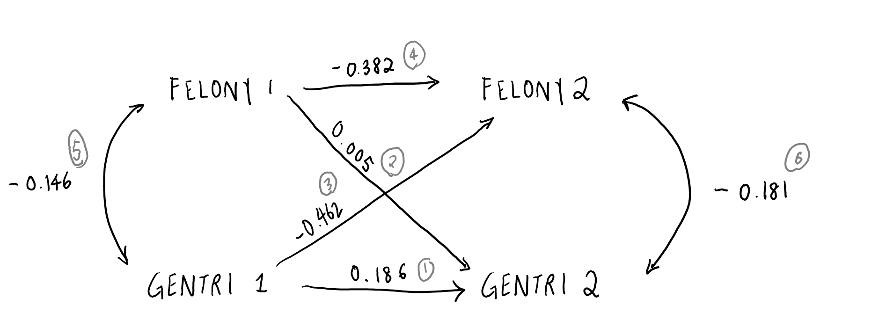

# SEM Models - SEM Two-way Cross-lagged Model   
  
This Time Series Cross-Lagged Model would analyze whether gentrification has led to an increase in crime rate in Brooklyn. 

```{r}
options(scipen = 999)
library(lavaan)
library(tidyverse)

bkg_years <- read.csv("data/bkg_years.csv")

```

## 1. Usual OLS Models   
  
```{r}


summary(lm(data = bkg_years, NTA_GENTRI_SCORE ~ FEL_NTA_CHANGE))
summary(lm(data = bkg_years, FEL_NTA_CHANGE ~ NTA_GENTRI_SCORE))


```

From the usual OLS model, for each increase in one point of change of felony crime rates per capita, there is likely to be a 11.27 decrease in gentrification score.   
In the other regression, for each increase in one point of gentrification score, there is likely to be a decrease in change of felony crime rates by -0.000108.  
  
    
## 2. SEM Two-way cross-lagged model  
Are either of the cross-lags significant?  
  
```{r}

bkg_years_split_1 <- bkg_years %>% 
  filter(YEAR %in% c(2010:2013)) %>% 
  group_by(NTA_CODE, NTA_NAME) %>%
  mutate(NTA_GENTRI_SCORE_1 = mean(NTA_GENTRI_SCORE)) %>% 
  mutate(FEL_NTA_CHANGE_1 = mean(FEL_NTA_CHANGE)) %>% 
  dplyr::select(NTA_NAME, NTA_CODE, NTA_GENTRI_SCORE_1, FEL_NTA_CHANGE_1) %>%
  distinct()

bkg_years_split_2 <- bkg_years %>% 
  filter(YEAR %in% c(2014:2017)) %>% 
  group_by(NTA_CODE, NTA_NAME) %>%
  mutate(NTA_GENTRI_SCORE_2 = mean(NTA_GENTRI_SCORE)) %>% 
  mutate(FEL_NTA_CHANGE_2 = mean(FEL_NTA_CHANGE)) %>%
  dplyr::select(NTA_NAME, NTA_CODE, NTA_GENTRI_SCORE_2, FEL_NTA_CHANGE_2) %>%
  distinct()

bkg_years_split <- bkg_years_split_1 %>% 
  left_join(bkg_years_split_2, by = c("NTA_NAME", "NTA_CODE"))

cl_model <- '
  NTA_GENTRI_SCORE_2 ~ NTA_GENTRI_SCORE_1 + FEL_NTA_CHANGE_1
  FEL_NTA_CHANGE_2 ~ NTA_GENTRI_SCORE_1 + FEL_NTA_CHANGE_1  
  NTA_GENTRI_SCORE_1 ~~ FEL_NTA_CHANGE_1
  FEL_NTA_CHANGE_2 ~~ FEL_NTA_CHANGE_2 '

cl_fit <- sem(cl_model, data = bkg_years_split)

summary(cl_fit, fit.measures = FALSE, standardized = TRUE, rsquare = TRUE)

```

```{r pressure, echo=FALSE, fig.cap="Cross-Laggged", out.width = '100%'}



```    

```{r}
beta_1 <- 0.462
beta_2 <- 0.005
stronger <- beta_1/beta_2

print(paste("There is evidence of mutual and reciprocal causation, though the effect of gentrification on felony crime rates (Beta = ", beta_1, ") is ", stronger, " times stronger than the opposite effect, (Beta = ", beta_2, ")", sep = ""))

```
  
## 3. Fit Measures  

```{r}
summary(cl_fit, fit.measures = TRUE, standardized = TRUE, rsquare = TRUE)
```

  
### Minimum Function Test Statistic  
    
   Number of observations                            50  
                                                      
Model Test User Model:  
                                                         
  Test statistic                                 0.000  
  Degrees of freedom                                 0  
  
Model Test Baseline Model:  
  
  Test statistic                                22.883  
  Degrees of freedom                                 6  
  P-value                                        0.001  
  
User Model versus Baseline Model:  
  
  Comparative Fit Index (CFI)                    1.000  
  Tucker-Lewis Index (TLI)                       1.000  
  
     
### Likelihood Ratio Tests to Compare Models  
    
User Model versus Baseline Model:  
  
  Comparative Fit Index (CFI)                    1.000  
  Tucker-Lewis Index (TLI)                       1.000  
    
Loglikelihood and Information Criteria:  
  
  Loglikelihood user model (H0)                 99.937  
  Loglikelihood unrestricted model (H1)         99.937  
                                                      
  Akaike (AIC)                                -179.874  
  Bayesian (BIC)                              -160.754  
  Sample-size adjusted Bayesian (BIC)         -192.142  
    
    
### Root Mean Square Error Measures  
  
Root Mean Square Error of Approximation:  
  
  RMSEA                                          0.000  
  90 Percent confidence interval - lower         0.000  
  90 Percent confidence interval - upper         0.000  
  P-value RMSEA <= 0.05                             NA  
  
Standardized Root Mean Square Residual:  
  
  SRMR                                           0.000  
  
